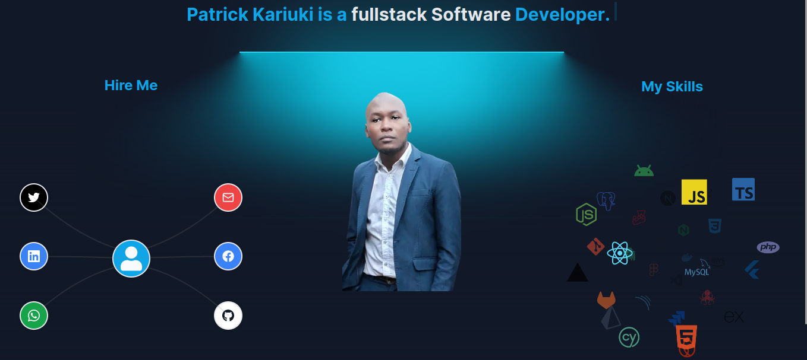
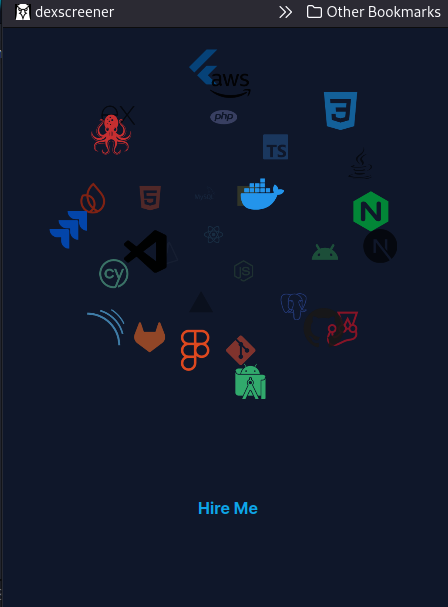

# Next.js Tailwind.css Fullstack Developer Portfolio

## Languages
1. TypeScript
2. javaScript
3. Tailwind css


Welcome to my [Next.js](https://nextjs.org/) fullstack web developer portfolio, built with Tailwind CSS and bootstrapped using [`create-next-app`](https://github.com/vercel/next.js/tree/canary/packages/create-next-app).

## Getting Started

To get started with this project:

1. **Clone the Repository**

```bash
   git clone https://github.com/patrickkariukikabita/portfolio.git
```
or download the code from this repository

2. **Navigate to the Project Directory**

```bash
   cd portfolio
```

3. **Install Dependencies**

   Install the project dependencies using npm:

```bash
   npm install
```

4. **Start the Development Server**

   Run the development server:

```bash
   npm run dev
   # or
   npm run start
```

5. **View the Application**

   Open [http://localhost:3000](http://localhost:3000) in your browser to view the application.

You can start editing the page by modifying `app/page.tsx`. The page will automatically update as you make changes.


## Project Overview

## Project Overview

This project includes a demonstration video:


## Screenshots

Here are some screenshots of the application:




## Live Preview

You can view a live preview of the project at:

- [portfolio.bytemast.com](https://portfolio.bytemast.com)

## Visit My Site

- [www.bytemast.com](https://bytemast.com) - An interactive Next.js tutorial.

Feel free to explore the project and provide feedback or suggestions.


